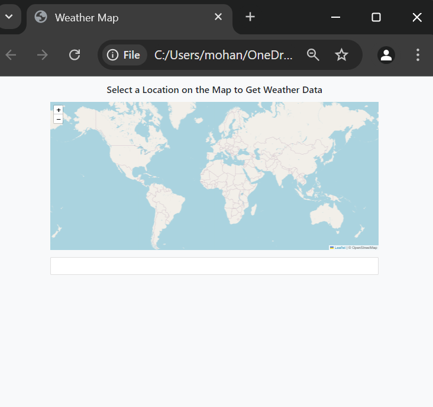
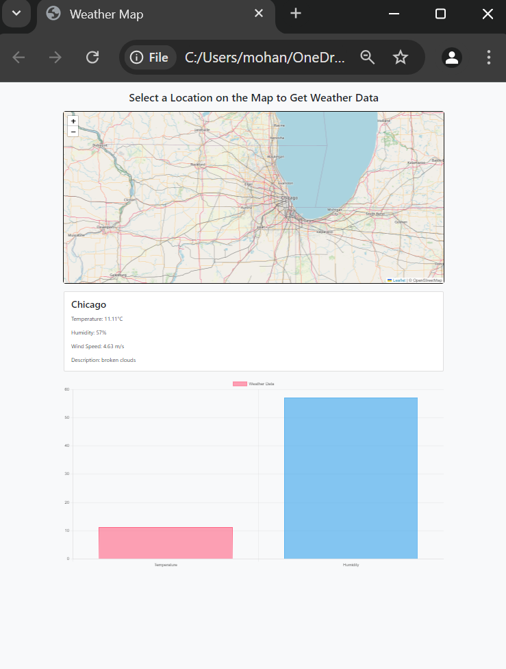

# 🌦️ Weather App


## Overview
The **Weather App** is a modern web application that allows users to select a location on an interactive map 🗺️ and retrieve real-time weather data 🌈 for that location. Utilizing the **OpenWeatherMap API**, this app provides an intuitive interface for users to explore current weather conditions.

## Features
- **Interactive Map**: Powered by [Leaflet.js](https://leafletjs.com/) 🗺️.
- **Real-time Weather Data**: Displays temperature 🌡️, humidity 💧, wind speed 🌬️, and weather descriptions ☁️.
- **Data Visualization**: Utilizes [Chart.js](https://www.chartjs.org/) 📊 for graphical representation of weather data.

## Technologies Used
- **HTML** for markup 📝
- **CSS** (Bootstrap) for styling 🎨
- **JavaScript** for functionality ⚙️
- **Leaflet.js** for maps 🗺️
- **Chart.js** for data visualization 📊
- **OpenWeatherMap API** for weather data ☁️

## Getting Started

### Prerequisites
- A modern web browser (Chrome, Firefox, etc.) 🌐
- A code editor (e.g., [Visual Studio Code](https://code.visualstudio.com/)) 💻
- (Optional) A local server for testing 🖥️

### Installation
1. **Clone the repository:**
   ```bash
   git clone https://github.com/amkc777/WeatherMapApp.git
   ```
2. **Navigate to the project directory:**
   ```bash
   cd WeatherMapApp
   ```

## Usage
1. Click on any location on the map to select it. 📍
2. The app will fetch and display the current weather data for the selected location. 🌦️

### Screenshots


<div align="center"> <p><strong>Before Selecting a Location</strong></p>  </div> <div align="center"> <p><strong>After Selecting a Location</strong></p>  </div>


## API Key
To run the application, you will need an API key from OpenWeatherMap. Replace the placeholder in `script.js` with your actual API key:
```javascript
const API_KEY = 'YOUR_API_KEY_HERE';
```

## Contributing
If you'd like to contribute to this project, feel free to:
- Open an issue ❗
- Submit a pull request 🔄

## License
This project is licensed under the [MIT License](LICENSE) 📜.

## Acknowledgements
- [OpenWeatherMap](https://openweathermap.org/) for providing the weather data API ☁️.
- [Leaflet.js](https://leafletjs.com/) for the mapping library 🗺️.
- [Chart.js](https://www.chartjs.org/) for the charting library 📊.

---

Thank you for checking out the Weather App! 🌍
